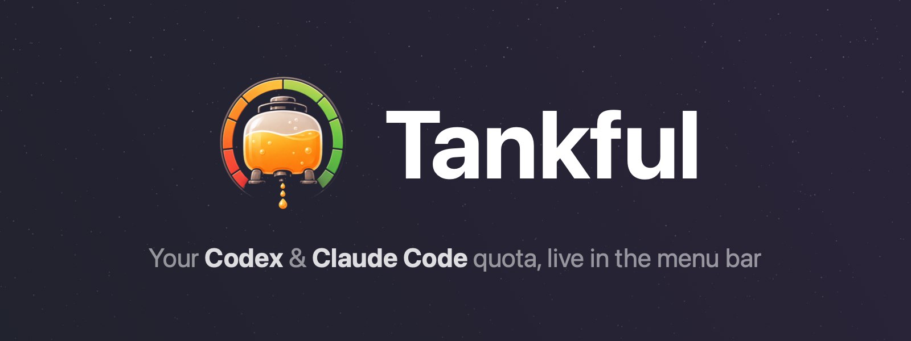

<p align="center">
  
</p>

A macOS menu-bar app that shows how much of your AI coding quota — Codex CLI and Claude Code CLI — you've used. 100% local, zero network.

[](https://github.com/yulingchen08/Tankful/actions/workflows/ci.yml)

## What it does

Tankful reads the local files Codex CLI and Claude Code already write to disk and turns them into a menu-bar readout: official quota percentages and time until reset for both services. It never talks to a network, never touches Keychain or credentials, and never sends anything anywhere — everything happens in the process reading your own files.

<p align="center">
  <picture>
    <source media="(prefers-color-scheme: dark)" srcset="docs/screenshot-dark.png">
    
  </picture>
</p>

## Install

One command downloads the latest prebuilt app, installs it to /Applications, wires up the Claude bridge and launches it — no Swift, Xcode or git needed:

```sh
curl -fsSL https://raw.githubusercontent.com/yulingchen08/Tankful/main/Scripts/install.sh | zsh
```

The installer fetches the zip with curl, which never marks files as quarantined, so the ad-hoc-signed app opens without any Gatekeeper prompt. Re-run the same command any time to update. The one prerequisite is Apple's Command Line Tools (for python3); the installer detects their absence and walks you through it.

### Build from source

A bundle you build yourself is ad-hoc signed by `Scripts/build-app.sh` and is never marked as quarantined, so it just opens — Gatekeeper's right-click → **Open** step only applies to a bundle that arrived from the internet, such as a zip downloaded through a browser.

```sh
git clone https://github.com/yulingchen08/Tankful.git
cd Tankful
Scripts/build-app.sh
mv .build/Tankful.app /Applications/   # move it before installing: the bridge path gets recorded
open /Applications/Tankful.app
Scripts/install-claude-bridge.sh   # wires up the Claude rate-limit bridge
```

The installer prefers `/Applications/Tankful.app` and falls back to `.build/Tankful.app`, so installing while the app still sits in `.build/` records a path that breaks the next time you clean or move it.

For development, run the app directly without building a bundle:

```sh
swift run TankfulApp
```

## The honesty principle

Tankful shows only what it can verify.

- **Codex CLI publishes a real quota.** Every Codex turn writes a `token_count` event with an official `used_percent` and reset time for each rate-limit window (5-hour and weekly, identified by the window's duration). Tankful reads the newest one and shows it as-is — no math, no guessing.
- **Claude Code now publishes a real quota too.** Since v2.1.80, Claude Code's statusline receives an official `rate_limits` object with `five_hour`/`seven_day` used percentages and reset times. A bundled bridge captures that field the moment Claude Code renders it; Tankful reads the capture and shows it as-is. Both services show official, Anthropic/OpenAI-reported numbers now — nothing in this app is estimated.
- **Stale and reset states are shown as states, not hidden.** If the newest data for either service is more than a few minutes old, the panel says "as of X ago" instead of presenting it as current. If a window's reset time has already passed but nothing has refreshed it since, the panel says the window reset and names what refreshes it — it never fabricates a fresh 0%.

## Privacy & data access

| Path | What is read/written | Mode | Network |
|---|---|---|---|
| `~/.codex/sessions/**/rollout-*.jsonl` | The newest `rate_limits` line in each candidate file (tail-only, last ≤1 MB read per file) | Read-only | None |
| `~/.claude.json` | One field: `oauthAccount.organizationType` (plan tier) | Read-only | None |
| `~/.claude/settings.json` | Edited **once**, by the installer only — one key (`statusLine.command`), with a timestamped backup written first. The app itself never opens this file. | Write (installer only) | None |
| `~/Library/Application Support/Tankful/claude-rate-limits.json` | Written by the bridge executable on every statusline render; contains only used-percentages and reset timestamps for each window — no message content, ever. Mode `0600`. | Read (app) / Write (bridge) | None |

Transcripts under `~/.claude/projects` are **not read at all** — Tankful no longer looks at conversation content in any form. The app process itself writes nothing and makes no network requests of any kind.

## Requirements

- macOS 15+
- Swift 6 toolchain (to build from source)

## FAQ

**Where do the Claude numbers come from?**
Claude Code's own statusline API. Since v2.1.80 it hands every statusline command a `rate_limits` object with official used-percentages — see [Anthropic's statusline docs](https://code.claude.com/docs/en/statusline). Tankful's bridge captures that field; nothing is computed or estimated.

**Why is the Claude row stale?**
Either there's no Claude Code session currently running a statusline, or the current session hasn't gotten its first API response yet. The bridge only sees data when Claude Code hands it some. Claude numbers also require a Pro or Max plan (free-tier accounts get no `rate_limits` field) and Claude Code v2.1.80+.

**Does anything leave my machine?**
No. There's no networking code anywhere in this app, including the bridge — confirm it yourself:

```sh
grep -rn "URLSession\|import Network\|Keychain" Sources/
```

**Is Tankful on the Mac App Store?**
No. It reads dotfiles outside the App Sandbox's reach (`~/.codex`, `~/.claude`), so it isn't sandboxed and isn't Store-eligible. Build it from source instead.

**Will this break my existing statusline?**
No. The bridge chains to whatever command was configured before it, replaying the same stdin and printing whatever it wrote to stdout byte-for-byte. The one case it does not stay silent: a chained command that both exits non-zero and prints nothing would leave the status line blank, so the bridge prints the model's display name instead. Uninstalling restores the original command exactly.

## Non-affiliation

Tankful is an independent, unofficial project. It is not affiliated with, endorsed by, or sponsored by Anthropic or OpenAI. "Claude," "Claude Code," "Codex," and related names are used only to describe the tools Tankful reads data from (nominative use). No brand logos are shipped — the UI uses only Apple's SF Symbols.

## License

MIT — see [LICENSE](LICENSE).
