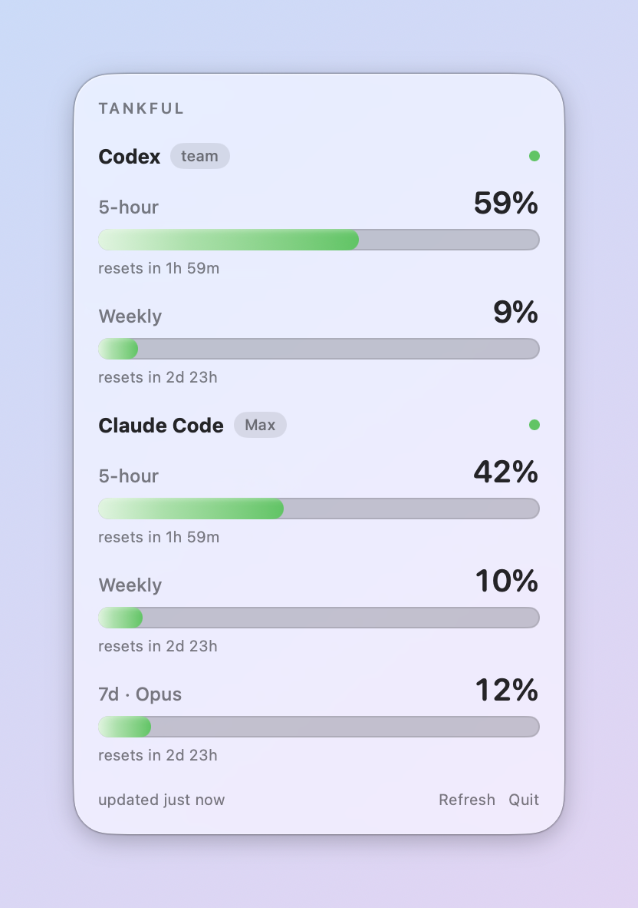

# Tankful 📊

A macOS menu-bar app that shows how much of your AI coding quota — Codex CLI and Claude Code CLI — you've used. 100% local, zero network.

[](https://github.com/yulingchen08/Tankful/actions/workflows/ci.yml)

## What it does

Tankful reads the local files Codex CLI and Claude Code already write to disk and turns them into a menu-bar readout: official quota percentages and time until reset for both services. It never talks to a network, never touches Keychain or credentials, and never sends anything anywhere — everything happens in the process reading your own files.

<p align="center">
  <picture>
    <source media="(prefers-color-scheme: dark)" srcset="docs/screenshot-dark.png">
    
  </picture>
</p>

## The honesty principle

Tankful shows only what it can verify.

- **Codex CLI publishes a real quota.** Every Codex turn writes a `token_count` event with an official `used_percent` and reset time for each rate-limit window (5-hour and weekly, identified by the window's duration). Tankful reads the newest one and shows it as-is — no math, no guessing.
- **Claude Code now publishes a real quota too.** Since v2.1.80, Claude Code's statusline receives an official `rate_limits` object with `five_hour`/`seven_day` used percentages and reset times. A bundled bridge captures that field the moment Claude Code renders it; Tankful reads the capture and shows it as-is. Both services show official, Anthropic/OpenAI-reported numbers now — nothing in this app is estimated.
- **Stale and reset states are shown as states, not hidden.** If the newest data for either service is more than a few minutes old, the panel says "as of X ago" instead of presenting it as current. If a window's reset time has already passed but nothing has refreshed it since, the panel says the window reset and names what refreshes it — it never fabricates a fresh 0%.

## How the Claude bridge works

Claude Code only hands rate-limit numbers to the *statusline command* it's configured to run — there's no other way to read them locally. Tankful ships a small executable, `TankfulBridge`, that installs itself in front of that command:

```
Claude Code → TankfulBridge → ~/Library/Application Support/Tankful/claude-rate-limits.json
                    │
                    └──chains to──▶ your original statusline command
```

On every statusline render, Claude Code pipes a JSON payload (including `rate_limits`) to the bridge on stdin. The bridge extracts the `five_hour`/`seven_day` used percentages and reset times, atomically writes them to a single snapshot file (mode `0600`), then runs your original statusline command with the same stdin and prints its stdout unchanged. Tankful's app process only ever reads that snapshot file — it never talks to Claude Code directly.

The snapshot lands in `~/Library/Application Support/Tankful/claude-rate-limits.json` unless the bridge is passed `--snapshot-path <file>`; the installer never passes it, so it only matters when running the bridge by hand.

Install it after building the app:

```sh
Scripts/install-claude-bridge.sh --dry-run   # preview the change first, if you'd like
Scripts/install-claude-bridge.sh             # edits statusLine.command in ~/.claude/settings.json
```

The installer backs up `settings.json` (timestamped copy, same directory) before writing, touches only the `statusLine.command` key, and chains your existing command so it keeps running exactly as before. To remove the bridge and restore what was there:

```sh
Scripts/install-claude-bridge.sh --uninstall
```

**Caveats:**
- The snapshot only updates while a Claude Code session is running *and* after that session has gotten its first API response — a fresh terminal with no messages sent yet has nothing to report.
- Requires a Claude Pro or Max plan; free-tier accounts don't get a `rate_limits` field. Requires Claude Code v2.1.80+.
- The numbers are account-wide, not per-machine. On a multi-machine setup, Tankful shows this machine's most recent observation of your account's shared limits — it can be behind what another machine last saw.
- If you move Tankful.app to a new location, re-run the installer so it re-points to the new binary path.
- Concurrent Claude Code sessions are fine: each one's bridge instance writes the same account-wide numbers, so the file just reflects whichever session rendered its statusline most recently (last-writer-wins).

## Privacy & data access

| Path | What is read/written | Mode | Network |
|---|---|---|---|
| `~/.codex/sessions/**/rollout-*.jsonl` | The newest `rate_limits` line in each candidate file (tail-only, last ≤1 MB read per file) | Read-only | None |
| `~/.claude.json` | One field: `oauthAccount.organizationType` (plan tier) | Read-only | None |
| `~/.claude/settings.json` | Edited **once**, by the installer only — one key (`statusLine.command`), with a timestamped backup written first. The app itself never opens this file. | Write (installer only) | None |
| `~/Library/Application Support/Tankful/claude-rate-limits.json` | Written by the bridge executable on every statusline render; contains only used-percentages and reset timestamps for each window — no message content, ever. Mode `0600`. | Read (app) / Write (bridge) | None |

Transcripts under `~/.claude/projects` are **not read at all** — Tankful no longer looks at conversation content in any form. The app process itself writes nothing and makes no network requests of any kind.

## Contributing

```sh
swift build
swift test
swiftlint lint --strict   # CI runs the same command, on a pinned SwiftLint version
```

Tests live in `Tests/TankfulCoreTests/` and cover `TankfulCore` only; there is no test target for the app. Anything worth a test therefore belongs in Core, which is why the pure decisions (parsing, freshness, the menu-bar title) live there rather than in the views.

### Adding a third service

There is no service registry, and adding one would cost more clarity than it buys — the two services are not symmetric (Codex reports its plan and a `rate_limit_reached_type` field inside the same event; Claude reports extra per-model windows and its plan tier comes from a different file). Adding a service is therefore an explicit, small edit in each of these places:

1. **Read it.** A snapshot model in `Sources/TankfulCore/Model/`, a reader that produces `(Snapshot?, Freshness)`, a path accessor on `Env` (`Sources/TankfulCore/Support/Env.swift`, since nothing in Core resolves `~` itself), and a `QuotaSource` conformance in `Sources/TankfulCore/Refresh/LiveSources.swift`.
2. **Refresh it.** In `Sources/TankfulCore/Refresh/QuotaRefresher.swift`: a snapshot and freshness field on `QuotaUpdate`, a `QuotaSource` parameter on `QuotaRefresher.init`, and a matching `async let` read in `load()`. Add the service's watch paths to `FileSystemWatchTargets` in `LiveSources.swift`.
3. **Hand it the source.** `Sources/TankfulApp/RefreshCoordinator.swift` builds the one live `QuotaRefresher`; the new source goes in that initializer call. Skipping this step is the compile error, since the initializer gained a parameter.
4. **Store it.** `Sources/TankfulApp/QuotaStore.swift` holds the snapshot and freshness the UI observes, and `apply` copies them out of the update.
5. **Show it.** A section view under `Sources/TankfulApp/Views/` (read the store with `@Environment(QuotaStore.self)`, as `CodexSectionView` does), added to the `sections` stack in `PanelView.swift`. If the service should be able to win the menu-bar title, extend `StatusTextComposer` and pass its snapshot and freshness at the call site in `StatusItemController.swift`.

Everything except steps 3–5 is testable without an app target — `Tests/TankfulCoreTests/QuotaRefresherTests.swift` shows how to drive a refresh with fake sources.

## Requirements

- macOS 15+
- Swift 6 toolchain (to build from source)

## Install

A bundle you build yourself is ad-hoc signed by `Scripts/build-app.sh` and is never marked as quarantined, so it just opens — Gatekeeper's right-click → **Open** step only applies to a bundle that arrived from the internet, such as a zip from a release.

```sh
git clone https://github.com/yulingchen08/Tankful.git
cd Tankful
Scripts/build-app.sh
mv build/Tankful.app /Applications/   # move it before installing: the bridge path gets recorded
open /Applications/Tankful.app
Scripts/install-claude-bridge.sh   # wires up the Claude rate-limit bridge
```

The installer prefers `/Applications/Tankful.app` and falls back to `build/Tankful.app`, so installing while the app still sits in `build/` records a path that breaks the next time you clean or move it.

For development, run the app directly without building a bundle:

```sh
swift run TankfulApp
```

## FAQ

**Where do the Claude numbers come from?**
Claude Code's own statusline API. Since v2.1.80 it hands every statusline command a `rate_limits` object with official used-percentages — see [Anthropic's statusline docs](https://code.claude.com/docs/en/statusline). Tankful's bridge captures that field; nothing is computed or estimated.

**Why is the Claude row stale?**
Either there's no Claude Code session currently running a statusline, or the current session hasn't gotten its first API response yet. The bridge only sees data when Claude Code hands it some.

**Does anything leave my machine?**
No. There's no networking code anywhere in this app, including the bridge — confirm it yourself:

```sh
grep -rn "URLSession\|import Network\|Keychain" Sources/
```

**Is Tankful on the Mac App Store?**
No. It reads dotfiles outside the App Sandbox's reach (`~/.codex`, `~/.claude`), so it isn't sandboxed and isn't Store-eligible. Build it from source instead.

**Will this break my existing statusline?**
No. The bridge chains to whatever command was configured before it, replaying the same stdin and printing whatever it wrote to stdout byte-for-byte. The one case it does not stay silent: a chained command that both exits non-zero and prints nothing would leave the status line blank, so the bridge prints the model's display name instead. Uninstalling restores the original command exactly.

## Non-affiliation

Tankful is an independent, unofficial project. It is not affiliated with, endorsed by, or sponsored by Anthropic or OpenAI. "Claude," "Claude Code," "Codex," and related names are used only to describe the tools Tankful reads data from (nominative use). No brand logos are shipped — the UI uses only Apple's SF Symbols.

## License

MIT — see [LICENSE](LICENSE).
